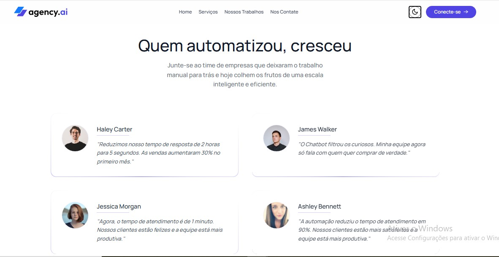

# 🤖 Agency.ai - Soluções em Chatbots para WhatsApp

<p align="center">
  
</p>

### Landing Page moderna para venda de agentes inteligentes e automação.

Este projeto é uma **Landing Page de alto impacto** desenvolvida para uma agência fictícia especializada em chatbots de inteligência artificial para WhatsApp. O foco principal foi criar uma interface fluida, responsiva e com uma experiência de usuário (UX) premium, utilizando as tecnologias mais modernas do ecossistema React.

---

## 📸 Visual do Projeto

Para demonstrar a versatilidade da interface, o projeto conta com suporte total a diferentes temas e seções focadas em prova social:

<p align="center">
  <b>Versão Dark Mode</b><br>
  
</p>

<p align="center">
  <b>Depoimentos e Social Proof</b><br>
  
</p>

---

## 🎯 Funcionalidades Principais

### ⚡ Performance Extrema
* **Vite:** Utilizado como build tool para garantir um carregamento quase instantâneo e uma experiência de desenvolvimento otimizada.
* **Componentização:** Arquitetura limpa e modular, facilitando a manutenção e escalabilidade do código.

### 🌓 Interface Dinâmica (Dark/Light Mode)
* Sistema de troca de temas inteligente que se adapta à preferência do usuário, garantindo conforto visual em qualquer ambiente.

### 📱 Design Totalmente Responsivo
* Layout desenvolvido com a metodologia **Mobile-First**, garantindo que a experiência de venda de chatbots seja perfeita em smartphones, tablets e desktops.

### 📨 Newsletter e Conversão
* Sessão de captura de leads integrada com validações de formulário, focada em transformar visitantes em potenciais clientes.

---

## 🚀 Tecnologias Utilizadas

* **React 18** (Biblioteca UI)
* **Vite** (Build Tool)
* **Tailwind CSS** (Estilização Utilitária)
* **Lucide React / Icons** (Iconografia moderna)


---

## 🛠️ Como rodar o projeto localmente

1. **Clone o repositório:**
   ```bash
   git clone [https://github.com/vitoriagiorgini/chatbot-ai.git](https://github.com/vitoriagiorgini/chatbot-ai.git)

2. **Entre na pasta do projeto:**
   ```bash
   cd chatbot-ai
   
3. **Instale as dependências:**
   ```bash
   npm install

4. **Inicie o servidor de desenvolvimento:**
   ```bash
   npm run dev

   O site será aberto localmente, geralmente no endereço http://localhost:5173.
      
